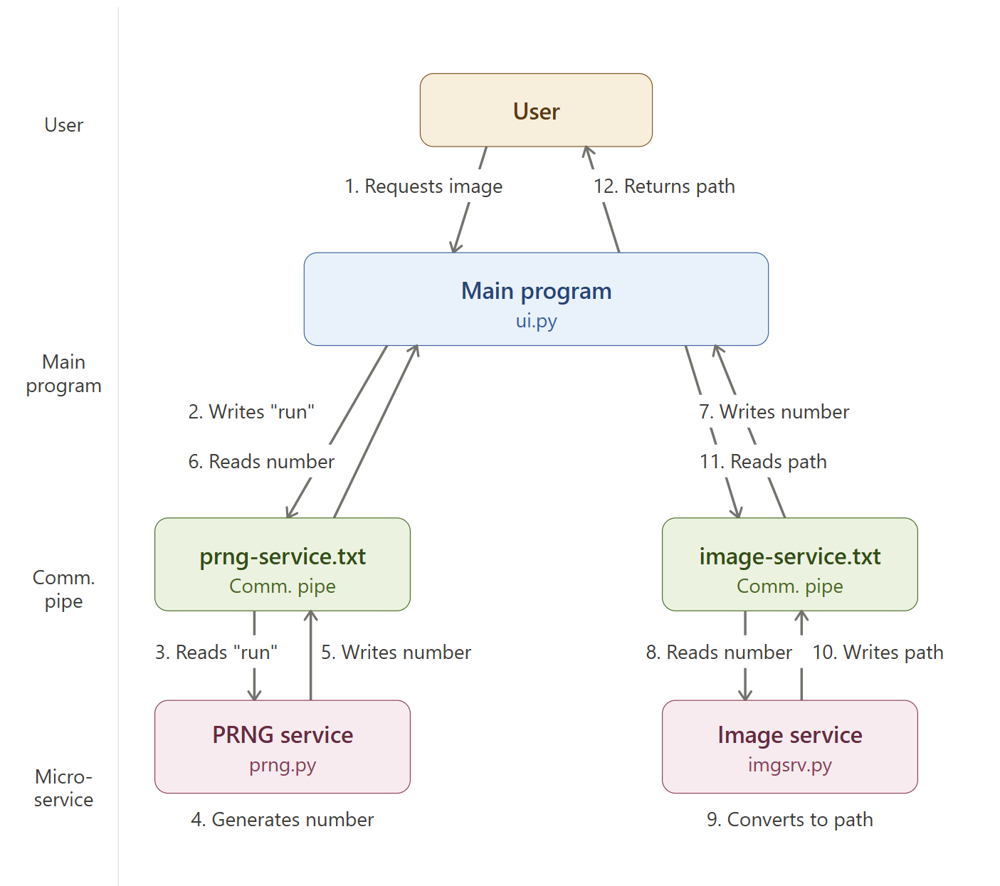

# Pizza Image Randomizer 🍕

A Python microservices demo that randomly generates pizza images using text-file-based inter-process communication.

## Overview

This project demonstrates a microservices architecture where independent services communicate through shared text files (acting as message pipes). Each service runs as a separate process and handles one specific task.

## Architecture


| Service | File | Description |
|---|---|---|
| `prng.py` | `prng-service.txt` | Generates a random number (1–3) |
| `imgsrv.py` | `image-service.txt` | Converts number to an image path |
| `ui.py` | both | User interface |

## Getting Started

### Prerequisites


### Installation
```bash
git clone https://github.com/yourusername/Pizza-Image-Randomizer-Demo.git
cd Pizza-Image-Randomizer-Demo
```

### Running the App

Open **3 separate terminals** in the project folder:

**Terminal 1:**
```bash
python prng.py
```
**Terminal 2:**
```bash
python imgsrv.py
```
**Terminal 3:**
```bash
python ui.py
```

Then follow the prompts in Terminal 3.

## Usage
```
--Pizza Generator--
Enter '1' to generate a pizza image or '2' to exit: 1
Your pizza is ready! 😋 Path: pizza-images/#.jpg |  ← Open file in editor (ctrl + click)
```


Happy Generating!

